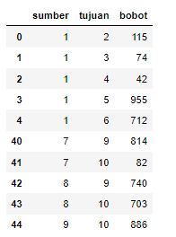
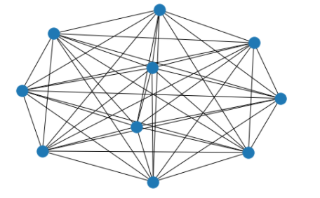
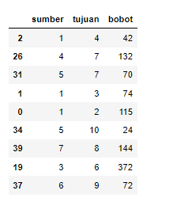
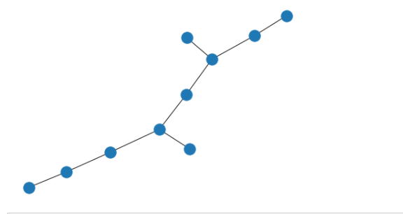

# Graf
Projek ini merupakan solusi optimum suatu masalah desain jaringan
Untuk mencari lintasan terpendek dengan graf tetapi terdapat faktor peluang 

Dimana data awal yang digunakan seperti tabel dibawah ini, dengan jumlah titik 10 dan jumlah sisi 45

dapat digambarkan data awal sebagai berikut :

Dari algoritma yang telah didesain pada algoritma didapatkan hasil MST sebagai berikut :

dan digambarkan hasil sebagai berikut : 

